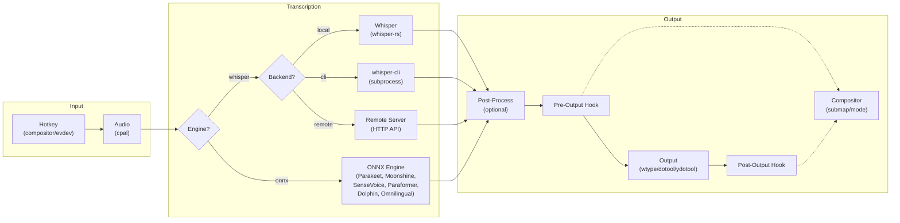

Voxtype is a Linux-native push-to-talk voice-to-text daemon. The architecture follows a modular, trait-based design with async event handling.

## High-Level Flow

```
Hotkey (compositor/evdev) → Audio Capture (cpal) → Transcription (whisper-rs/ONNX) → Text Processing → Output (wtype/dotool/ydotool/clipboard)
```

## System Diagram



## Core Components

### Daemon and State Machine

| Component | Location | Purpose |
|-----------|----------|----------|
| **Daemon** | `src/daemon.rs` | Main event loop with `tokio::select!`, state coordination |
| **State** | `src/state.rs` | State machine: Idle → Recording → Transcribing → Outputting |
| **CLI** | `src/cli.rs` | Command definitions and argument parsing |
| **Config** | `src/config.rs` | TOML parsing, defaults, validation |

**Async Runtime:** Voxtype uses Tokio for async operations. The main loop multiplexes hotkey events, signals, and task completion using `tokio::select!`.

### Hotkey Detection

**Preferred: Compositor keybindings** (Hyprland, Sway, River)
- Native integration with compositor
- No special permissions needed
- Supports key-release events for push-to-talk
- Voxtype provides `voxtype record start/stop/toggle` commands

**Fallback: evdev listener**
- Kernel-level input detection via `/dev/input/event*`
- Works on X11 and as universal fallback
- Requires user to be in `input` group
- Direct access to Linux input subsystem

**Why compositor keybindings?** Wayland compositors like Hyprland, Sway, and River support key-release events, enabling push-to-talk without special permissions. The compositor processes the hotkey before any grabbing happens, making it more reliable than evdev.

### Audio Capture

**Implementation:** `src/audio/cpal_capture.rs`

- Uses **cpal** (Cross-Platform Audio Library) for audio input
- Supports PipeWire, PulseAudio, and ALSA backends
- Streams audio data via mpsc channels to avoid blocking
- Records at 16kHz sample rate (Whisper's native rate)
- Configurable max duration and device selection

**Audio feedback:** Optional sound cues when recording starts/stops using the rodio audio playback library.

### Transcription Engines

Voxtype supports multiple transcription engines across two runtime backends:

#### Whisper Backend (default)

**Local in-process (`whisper.rs`):**
- OpenAI's Whisper model via whisper.cpp bindings
- 99 languages supported
- Optional GPU acceleration (Vulkan, CUDA, ROCm, Metal)
- Model loading hidden behind recording time with `prepare()` method
- Optional on-demand loading to save memory

**CLI subprocess (`subprocess.rs`):**
- Runs `whisper-cli` as external process
- Isolates GPU memory (released after transcription)
- More stable on some systems (glibc 2.42+ compatibility)

**Remote HTTP API (`remote.rs`):**
- OpenAI-compatible HTTP endpoints
- Offload transcription to remote server
- Useful for low-power devices

#### ONNX Engines

**Engine options:**
- **Parakeet** - Fast English transcription (FastConformer TDT)
- **Moonshine** - Edge devices, low memory (encoder-decoder)
- **SenseVoice** - Chinese, Japanese, Korean (CTC encoder)
- **Paraformer** - Chinese-English bilingual (non-autoregressive)
- **Dolphin** - 40 languages + Chinese dialects, no English (CTC E-Branchformer)
- **Omnilingual** - 1600+ languages (wav2vec2 CTC)

**Why multiple engines?** Different models excel at different tasks:
- Whisper: General-purpose, best for English and European languages
- SenseVoice/Paraformer: Native CJK support
- Parakeet: Fastest English-only option
- Omnilingual: Rare and low-resource languages

Switch engines with `voxtype setup onnx` or via config:
```toml
engine = "sensevoice"  # or: whisper, parakeet, moonshine, paraformer, dolphin, omnilingual
```

### Text Processing

**Implementation:** `src/text/mod.rs`

**Word replacements:** Fix commonly misheard words
```toml
[text]
replacements = { "vox type" = "voxtype", "oh marky" = "Omarchy" }
```

**Spoken punctuation:** Convert spoken words to symbols
```toml
[text]
spoken_punctuation = true
```
Saying "function open paren close paren" outputs `function()`.

**Post-processing command:** Pipe transcriptions through external tools (LLMs, custom scripts)
```toml
[output.post_process]
command = "ollama run llama3.2:1b 'Clean up this dictation. Fix grammar, remove filler words:'"
timeout_ms = 30000
```

### Output Driver Chain

**Why multiple drivers?** No single output method works everywhere:
- wtype needs Wayland + virtual-keyboard protocol
- KDE/GNOME don't support virtual-keyboard protocol
- ydotool needs daemon + doesn't support keyboard layouts
- dotool supports layouts but needs uinput access

**Fallback chain:** wtype → dotool → ydotool → clipboard

<Tabs>
  <Tab title="wtype">
    **Implementation:** `src/output/wtype.rs`
    
    - Wayland-native via virtual-keyboard protocol
    - Best Unicode/CJK support
    - No daemon required
    - Works on: Hyprland, Sway, River, wlroots compositors
    - Doesn't work on: KDE Plasma, GNOME (protocol not implemented)
  </Tab>
  <Tab title="dotool">
    **Implementation:** `src/output/dotool.rs`
    
    - Works on X11/Wayland/TTY via uinput
    - Supports keyboard layouts via XKB (`DOTOOL_XKB_LAYOUT`)
    - No daemon required
    - Requires user in `input` group
    - Recommended for non-US layouts and KDE/GNOME
  </Tab>
  <Tab title="ydotool">
    **Implementation:** `src/output/ydotool.rs`
    
    - Works on X11/Wayland/TTY via uinput
    - Requires `ydotoold` daemon running
    - No keyboard layout support (sends raw US keycodes)
    - Final typing fallback before clipboard
  </Tab>
  <Tab title="clipboard">
    **Implementation:** `src/output/clipboard.rs`
    
    - Universal fallback via wl-copy/xclip
    - User must paste manually (Ctrl+V)
    - Always works when other methods fail
  </Tab>
</Tabs>

**Paste mode:** Copies to clipboard then simulates Ctrl+V. Useful for non-US keyboard layouts where typing fails.

**Output hooks:** Pre/post hooks can trigger compositor submaps to block modifier key interference:
```toml
[output.hooks]
pre = "hyprctl dispatch submap voxtype_typing"
post = "hyprctl dispatch submap reset"
```

## Design Decisions

### Trait-Based Extensibility

Each major component defines a trait allowing multiple implementations:

| Trait | Implementations | Extension Point |
|-------|----------------|------------------|
| `HotkeyListener` | `EvdevListener` | Add libinput, compositor-specific listeners |
| `AudioCapture` | `CpalCapture` | Add JACK, direct ALSA support |
| `Transcriber` | `WhisperTranscriber`, `RemoteTranscriber`, `SubprocessTranscriber` | Add new ASR backends |
| `TextOutput` | `WtypeOutput`, `DotoolOutput`, `YdotoolOutput`, `ClipboardOutput` | Add X11, compositor-specific output |

This makes Voxtype easily extensible without modifying core logic.

### Configuration Layering

**Priority (highest wins):**
1. CLI arguments (`--model base.en`)
2. Environment variables (`VOXTYPE_WHISPER_MODEL`)
3. Config file (`~/.config/voxtype/config.toml`)
4. Built-in defaults

This allows overriding any setting at any level without modifying config files.

### GPU Memory Management

**Trade-off:** GPU memory isn't released after in-process transcription, causing memory growth over time.

**Options:**
- **Default (in-process):** Keep model loaded for faster subsequent transcriptions
- **GPU isolation (`gpu_isolation = true`):** Spawn child process that exits after transcription, releasing GPU memory
- **CLI backend:** Always uses subprocess, isolates GPU memory automatically

Users choose based on their hardware and usage patterns.

### CPU Compatibility

**Problem:** Binaries built on modern CPUs can contain AVX-512/GFNI instructions that crash on older CPUs.

**Solution:** Install SIGILL handler via `.init_array` constructor (runs before `main()`). If triggered, displays helpful message instead of silent crash.

Release binaries are built in Docker containers with Ubuntu 22.04/24.04 to ensure clean toolchains without modern CPU instructions.

## Module Structure

```
src/
├── hotkey/           # Keyboard input detection
│   ├── mod.rs        # HotkeyListener trait, factory
│   └── evdev_listener.rs  # Kernel-level via evdev
├── audio/            # Audio I/O
│   ├── mod.rs        # AudioCapture trait, factory
│   ├── cpal_capture.rs   # PipeWire/PulseAudio/ALSA via cpal
│   └── feedback.rs   # Audio playback for cues
├── transcribe/       # Speech-to-text
│   ├── mod.rs        # Transcriber trait, factory
│   ├── whisper.rs    # Local in-process via whisper-rs
│   ├── remote.rs     # HTTP API (OpenAI-compatible)
│   ├── subprocess.rs # GPU isolation wrapper
│   └── worker.rs     # Child process entry point
├── output/           # Text delivery
│   ├── mod.rs        # TextOutput trait, factory, fallback chain
│   ├── wtype.rs      # Wayland-native
│   ├── dotool.rs     # Keyboard layout support via uinput
│   ├── ydotool.rs    # X11/TTY fallback
│   ├── clipboard.rs  # Universal fallback
│   ├── paste.rs      # Clipboard + Ctrl+V
│   └── post_process.rs   # LLM cleanup command
├── text/             # Text transformations
│   └── mod.rs        # Spoken punctuation, replacements
└── setup/            # Installation helpers
    ├── model.rs      # Model selection & download
    ├── gpu.rs        # GPU feature detection
    ├── waybar.rs     # Waybar config snippets
    ├── systemd.rs    # Service installation
    └── compositor.rs # Hyprland/Sway/River keybinding setup
```

## Performance Considerations

- **Avoid allocations in hot path:** Hotkey detection and audio streaming are allocation-free
- **Async I/O:** Long-running operations use `spawn_blocking` to avoid blocking event loop
- **Model loading optimization:** `prepare()` method loads model during recording time
- **Streaming over buffering:** Audio data streams via channels, transcription outputs incrementally
- **On-demand loading:** Optional model loading only when recording starts (saves memory)

## State Machine

```
┌──────┐
│ Idle │ ◄────────────────────┐
└──┬───┘                       │
   │ hotkey pressed            │
   ▼                           │
┌───────────┐                  │
│ Recording │                  │
└─────┬─────┘                  │
      │ hotkey released        │
      ▼                        │
┌──────────────┐               │
│ Transcribing │               │
└──────┬───────┘               │
       │ transcription done    │
       ▼                       │
┌────────────┐                 │
│ Outputting │ ────────────────┘
└────────────┘ text delivered
```

Each state transition is logged and exposed via the state file for Waybar/polybar integration.

See the [Developer Guide](https://github.com/peteonrails/voxtype/blob/main/CLAUDE.md) for code-level architecture details.
